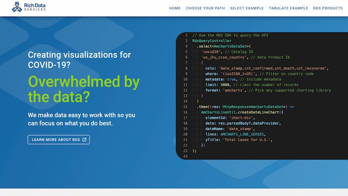
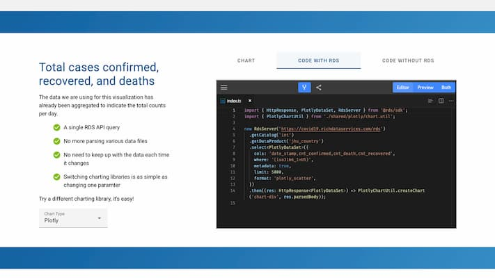
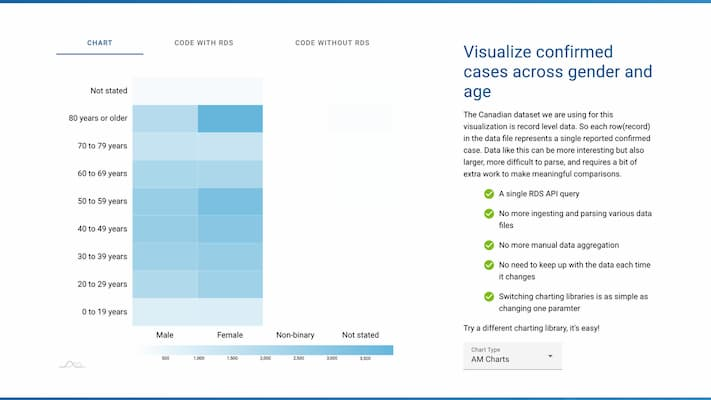

# RDS - JS - Examples

#### _WARNING: THIS PROJECT IS IN EARLY DEVELOPMENT STAGE. CONTENT OR CODE SHOULD ONLY BE USED FOR TESTING OR EVALUATION PURPOSES._


[](https://github.com/semantic-release/semantic-release)
[](https://github.com/prettier/prettier)

| [Covid-19 demo app](https://mtna.github.io/rds-js-examples/) | [Edit the source code](https://mtna.github.io/rds-js-examples/#select-query) | [Various visualizations](https://mtna.github.io/rds-js-examples/#tabulate-query) |
| ------------------------------------------------------------ | ---------------------------------------------------------------------------- | -------------------------------------------------------------------------------- |
|        |                        |                      |

<a href="https://www.richdataservices.com"></a>

**Rich Data Services** (or **RDS**) is a suite of REST APIs designed by Metadata Technology North America (MTNA) to meet various needs for data engineers, managers, custodians, and consumers. RDS provides a range of services including data profiling, mapping, transformation, validation, ingestion, and dissemination. For more information about each of these APIs and how you can incorporate or consume them as part of your work flow please visit the MTNA website.

**RDS-JS-Examples** is TypeScript/JavaScript repository for showcases and examples to demonstrate using the RDS API. Many of the examples will leverage the RDS JavaScript SDK to simplify and faciliate interacting with any given RDS API. By using this SDK you will add to your project the benefit of strong types and easy to use helper functions that directly reflect the RDS API.

Be sure to checkout the sdk source code and documentation.

## References

| [RDS JavaScript SDK](https://github.com/mtna/rds-js) | [RDS API Documentation](https://covid19.richdataservices.com/rds/swagger/) | [RDS](https://www.richdataservices.com/) | [Contributing](CONTRIBUTING.md) | [Developer Documentation](DEVELOPER.md) | [Changelog](CHANGELOG.md) |
| ---------------------------------------------------- | -------------------------------------------------------------------------- | ---------------------------------------- | ------------------------------- | --------------------------------------- | ------------------------- |


## Quick start

1. Clone this repository and navigate into the directory.
2. Install dependencies
   ```shell
   npm i
   ```
3. Run the application on a local development server
   ```
   npm start
   ```
   Open your browser to http://localhost:4200

## Development

This repository leverages a few technologies to make development simple.

- [Parcel](https://parceljs.org/) to build and bundle
- [Material Design Components for the Web](https://github.com/material-components/material-components-web/)
- [Sass](https://sass-lang.com/)
- [posthtml-include](https://github.com/posthtml/posthtml-include)

Running `npm start` will compile TypeScript and Sass files, combine html partials (via posthtml-include) and serve on http://localhost:4200. It will watch for file changes and automatically rebuild and refresh the page on save.

## Build

Production builds are simple thanks to Parcel. Just run `npm run build` and the compiled output will be placed in the `/dist` directory.

## Contribute

Putting this product together and maintaining the repository takes time and resources. We welcome your support in any shape or form, in particular:

- Fork/clone, and contribute to the package
- Let us know is you find any discrepancy or have suggestions towards enhancing the content or quality of the library
- Buy us a beer/coffee! Donations are appreciated and can be made through [PayPal](https://www.paypal.com/cgi-bin/webscr?cmd=_s-xclick&hosted_button_id=GKAYVJSBLN92E)
- Consider using RDS or any of our data/metadata [services, products, or expertise](http://www.mtna.us)
